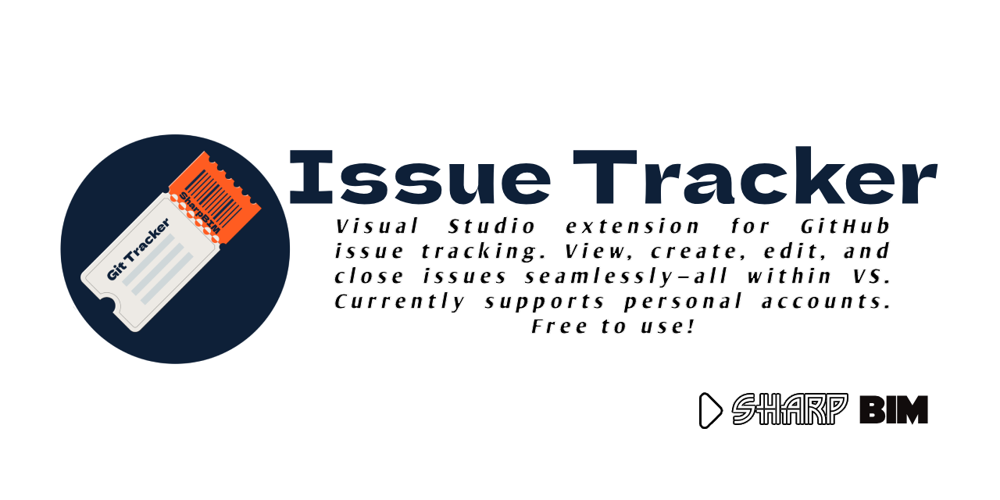
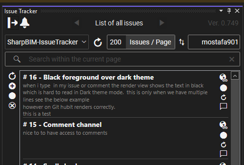
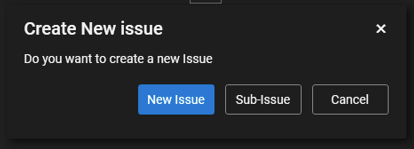
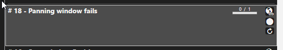

# 🚀 Issue Tracker

## 🔥 Features & Functionality  
- 📌 **Issue Tracking** – View GitHub issues directly in Visual Studio  
- ➕ **Create New Issues & Sub-Issues** – Easily add and manage tasks  
- ✏️ **Edit Issues** – Modify issue titles, descriptions, and labels  
- ✅ **Close Issues** – Mark issues as resolved within the extension  

## :hand: Important
images are committed to the selected Repo's default branch under Images folder. Unfortunately, there is no API access to private user contents to have images embedded inside your issue. another work around is to link the image from any cloud.

## How it works

- Simply use your own personal token, tso you have a direct access to all your repos
- or register the app to allow the app access your account.
- select the rpo from the drop down repo list to view all issues related to the selected repo
- double click on an issue to edit its title, and body
- once finished hit upload to push your changes.
- for sub issues:
    - select an issue then click on the plus button to create a new (sub) issue  
    - once created you will be in edit page to edit and upload
    when you upload you will see progress meter as indication to how many sub-issues available
    
    - to list all sub issues, you can hit over the progress bar to view them all.

## ⚠️ Limitations  
- Currently supports **only personal GitHub accounts**  
- Some UI elements are still **work in progress** (e.g., issue details page improvements)  

## 🛠️ What’s Next?  
- Enhancing the **issue detail page** with a more attractive UI  
- Support for **organization repositories**  
- Additional filtering and sorting options  

If you find any bugs or have feature requests, please **report an issue** in the repository! 🚀  
