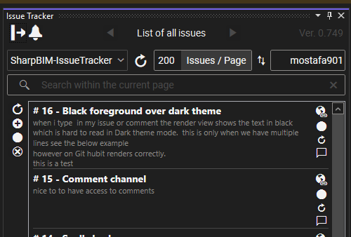
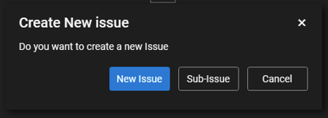
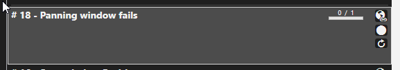



# 🚀 Issue Tracker

`

## 🔥 Features & Functionality  
- 📌 **Issue Tracking** – View GitHub issues directly in Visual Studio  
- ➕ **Create New Issues & Sub-Issues** – Easily add and manage tasks  
- ✏️ **Edit Issues** – Modify issue titles, descriptions, and labels  
- ✅ **Close Issues** – Mark issues as resolved within the extension  

## :hand: Important
images are committed to the selected Repo's default branch under Images folder. Unfortunately, there is no API access to private user contents to have images embedded inside your issue. another work around is to link the image from any cloud.

## How it works

- Simply use your personal token to gain direct access to all your repositories.
- Alternatively, register the app to allow it access to your account.
- Select the repository from the dropdown list to view all issues related to the chosen repository.
- Double-click on an issue to edit its title and body.
- Once you're finished, click **"Upload"** to push your changes.

### For sub-issues:
  - Select an issue and click the **plus button** to create a new sub-issue.

  
  - After creation, you will be redirected to the edit page to make changes and upload them.
  - When uploading, you'll see a progress meter indicating the number of available sub-issues.
  
  - To view all sub-issues, hover over the progress bar to see the full list.

## ⚠️ Limitations  
- Currently supports **only personal GitHub accounts**  
- Some UI elements are still **work in progress** (e.g., issue details page improvements)  

## 🛠️ What’s Next?  
- Enhancing the **issue detail page** with a more attractive UI  
- Support for **organization repositories**  
- Additional filtering and sorting options  

If you find any bugs or have feature requests, please **report an issue** in the repository! 🚀  
